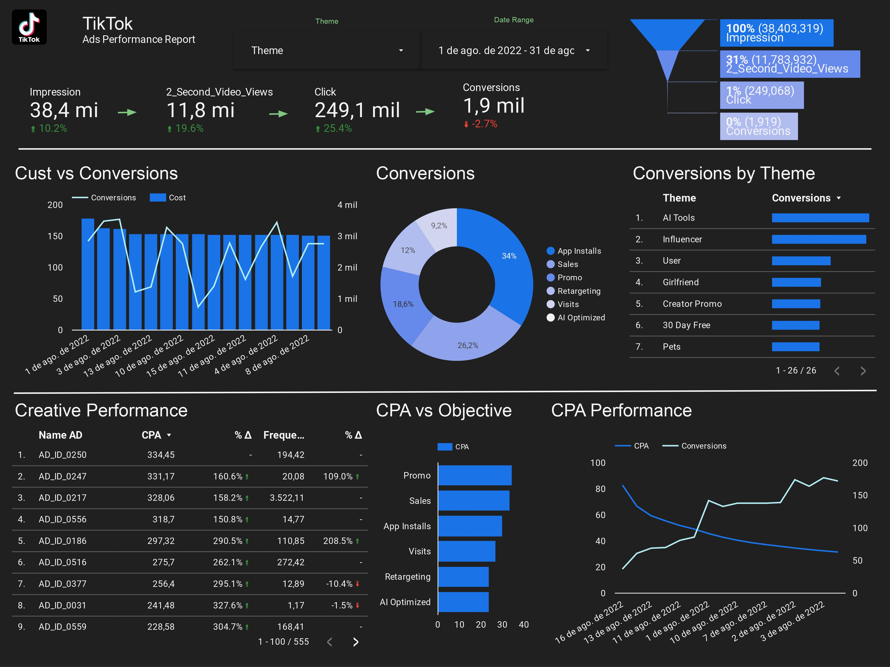

# **Dashboard de Performance de Anúncios TikTok**

## **Visão Geral do Projeto**
Este projeto apresenta um **Dashboard de Performance de Anúncios no TikTok** criado com o **Looker**. Ele foi desenvolvido para monitorar e otimizar a performance de uma campanha de anúncios para um aplicativo, em um período específico: **1 de agosto de 2022 a 31 de agosto de 2022**. Os insights derivados desse dashboard são cruciais para orientar decisões estratégicas sobre alocação de orçamento, ajustes criativos e otimização de segmentação.

### **Screenshot**

## **Link para visualização online**
https://lookerstudio.google.com/reporting/8c149722-dbb9-4108-ae74-fb2592aad548 

## **Insights Principais**

- **Impressões**: 38,4M ( ↑ 10,2%)
- **Visualizações de Vídeo de 2 Segundos**: 11,8M ( ↑ 19,6%)
- **Cliques**: 249,1K ( ↑ 25,4%)
- **Conversões**: 1,9M ( ↓ 2,7%)

## **Resumo dos Insights**

### 1. **Impressões e Engajamento**:
   - As impressões cresceram **10,2%**, indicando um aumento positivo na exposição dos anúncios.
   - As **visualizações de vídeo de 2 segundos** aumentaram em **19,6%**, sugerindo maior engajamento com o conteúdo de vídeo.
   - A **Taxa de Cliques (CTR)** também apresentou um aumento positivo (**25,4%**), mostrando que o conteúdo está ressoando com o público.
   - No entanto, houve uma leve queda nas **Conversões** (↓2,7%), o que sugere que, embora os usuários estejam interagindo com os anúncios, o funil final de conversão precisa de otimização.

### 2. **Análise do Funil de Conversão**:
   - **100% Impressões** -> **31% Visualizações de Vídeo** -> **1% Cliques** -> **0% Conversões**.
   - Há uma queda significativa dos cliques para as conversões. Isso pode ser devido a problemas na página de destino, desalinhamento entre o anúncio e o produto ou uma estratégia de conversão ineficaz.

### 3. **Conversões por Tema**:
   - Anúncios relacionados a **Ferramentas de IA** (34% do total de conversões) são os que geram mais conversões, seguidos por **Vendas** (26,2%) e **Promoção** (18,6%).
   - Temas como **Influenciador** e **Promoção de Criador** tiveram desempenho inferior em termos de conversões, indicando a necessidade de ajustes no conteúdo ou reavaliação desses temas.

### 4. **Custo vs Conversões**:
   - O gráfico **Custo vs Conversões** mostra grandes flutuações no custo dos anúncios enquanto as conversões permanecem relativamente estáveis. Isso sugere ineficiências na alocação de gastos com anúncios, e uma realocação de orçamento pode ser explorada.

### 5. **Performance Criativa**:
   - Anúncios como **AD_ID_0250** e **AD_ID_0247** têm altos **Custos por Aquisição (CPA)**, mostrando **194,4%** e **109%** de aumento na frequência, indicando que estão sendo superexpostos. Esses anúncios podem se beneficiar de um limite de frequência ou renovação criativa.
   - Por outro lado, anúncios como **AD_ID_0559** mostraram uma melhoria de **304,7%** no CPA, tornando-se um dos anúncios mais eficientes em termos de custo.

### 6. **CPA por Objetivo**:
   - Anúncios direcionados para **Promoções** têm o CPA mais alto, sugerindo um possível gasto excessivo em objetivos promocionais sem obter conversões proporcionais.
   - **Instalações de App** e **Visitas** apresentaram valores de CPA menores, indicando melhor eficiência nesses objetivos de campanha.

### 7. **Performance do CPA**:
   - O gráfico **CPA vs Conversões** sugere que, enquanto o CPA está diminuindo ao longo do tempo, as conversões estão flutuando. Otimizar a alocação de orçamento para anúncios com menor CPA e maiores taxas de conversão pode melhorar a eficiência geral.

## **Recomendações**
- **Otimizar o Funil de Conversão**: A queda acentuada entre cliques e conversões indica que as experiências pós-clique (como páginas de destino) precisam ser melhoradas. Testes A/B em páginas de destino e o alinhamento entre a mensagem do anúncio e a página de destino podem ajudar a melhorar as taxas de conversão.
- **Renovação Criativa e Limite de Frequência**: Anúncios que mostraram um aumento significativo na frequência, como o **AD_ID_0250**, devem ser renovados para evitar a fadiga do público. A imposição de um limite de frequência também pode ajudar a evitar retornos decrescentes devido à superexposição.
- **Realocação de Orçamento**: Anúncios que estão tendo um desempenho inferior em termos de CPA, como aqueles direcionados para **Promoções**, devem ter seu orçamento reduzido em favor de temas mais eficientes, como **Instalações de App** e **Visitas**.
- **Otimização de Temas**: Concentre-se mais nas **Ferramentas de IA**, que é o tema de melhor desempenho, enquanto revê ou pausa temas como **Influenciador** e **Pets**, que não estão entregando resultados significativos.

## **Tecnologias Utilizadas**
- **Looker**: Para visualização de dados e criação de dashboards.
- **Plataforma de Anúncios do TikTok**: Para coleta de dados da campanha de anúncios.

## **Conclusão**
Este dashboard fornece insights claros e acionáveis sobre a performance de campanhas de anúncios no TikTok. Ao analisar métricas-chave, como CPA, conversões e performance criativa, podemos otimizar os gastos com anúncios, ajustar estratégias criativas e, por fim, melhorar o retorno sobre investimento (ROI) da campanha. A apresentação visual dos dados neste dashboard do Looker facilita o entendimento das tendências complexas e permite que as partes interessadas tomem decisões informadas.

## Autor
- [@pedrolporto](https://www.github.com/pedrolporto)

## Dados

- Dados fornecidos pela DataTechFlorida.

